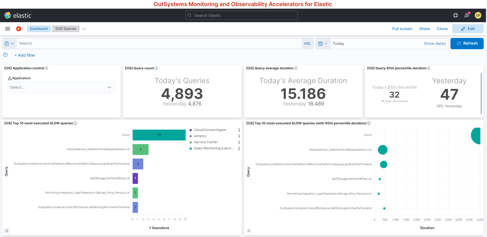

# outsystems-elastic-integration 🚀

## About 📑
This repository contains [Elastic](https://elastic.co/) accelerators to provide better and faster insights on top of [OutSystems](https://www.outsystems.com/) monitoring data.

These accelerators are:
- **Elasticsearch definitons**
    - Help to set up indices and their lifecycle policies.
    - See it at [data_storing-elasticsearch](data_storing-elasticsearch)
- **Logstash pipelines**
    - Simplify the ETL of monitoring data from the OutSystems platform.
    - Enrich data to allow building more human-readable visualizations.
    - - See it at [data_storing-elasticsearch](data_storing-elasticsearch)
- **Kibana dashboards**
    - Provide an out-of-the-box set of visualizations that help understand OutSystems applications and platform health, based on their performance and errors.
    - Reduce time to insights (based on OutSystems monitoring data).
    - Improve troubleshooting capabilities.

 

Example of one of the visualizations available on this repository:

 

:exclamation: To know how to set up and use this repository artifacts you can go directly to the this section [How to use the contents of this repository](How-to-use-the-contents-of-this-repository)

:exclamation: **Want to support to implement or extend this assets?**
Contact OutSystems Professional Services. You can know more about us at:
https://www.outsystems.com/success-services/professional-services/ 
  
 

## Goal 🎯
The major goal of these accelerators is to provide OutSystems customers with an out-of-the-box solution to:
- Easily **observe the OutSystems monitoring data on Elastic with more advanced visualizations**, compared to the ones from the built-in tools of the OutSystems platform.
- Easily search through OutSystems monitoring data, in particular through the OutSystems logs with:
    - Free text search.
    - Selection of visible information.
- **Do more advanced monitoring**, compared to what can be done using the built-in tools of the OutSystems platform. Things like:
    - Build alerts for an OutSystems environment or OutSystems Factory.
    - Leverage Elastic analytic capabilities to have deeper insights on performance and behaviour of applications, and the platform itself.
- **Observe OutSystems applications performance and errors through time**.
    - Quickly pinpoint performance bottlenecks, areas to improve, etc.
    - Figure out what is affecting performance:
        - Slow Queries
        - Slow Integrations
        - Slow Extensions
- Provide an example of how to **set up and monitor SLOs**.

 

## Outcomes ✅
- Fast and efficient set up of advanced monitoring and observability solution with a free version. But also with support from Elastic and/or OutSystems Professional Services
- Fast detection of performance and availability issues (of potential or existing)
- Lower troubleshooting times
- Increase the insights to continuously improve your applications and factory through a data drive approach.

  

## Examples of metrics can you measure
Here are some examples of OutSystems metrics that can be monitored using these accelerators:
- **Request Time Duration** (for each request):
    - Client Time (load time)
    - Server Time, which can be decomposed into:
        - SAT (Session Acquisition Time)
        - Query Execution Time
        - Integration Execution Time
        - Extension Execution Time
- **Server side performance metrics**
    - Session size
    - Viewstate size
    - Number of slow queries
    - Number of slow integrations
    - Number of slow extensions
- **Errors metrics**
    - Number of errors
    - Number of errors by type

> These metrics are the ones that **OutSystems Professional Services Experts** teams consider to be a starting point to understand applications and platform performance.

> As stated, these are just examples of some metrics that can be monitored, based on the platform data.

 

## How to use the contents of this repository
If you have low to no experience with the Elastic stack, you can refer to:
- [How to set up the necessary Elastic stack](docs/Elastic_Stack_Installation/README.md).

If you are good with setting up the Elastic stack, and you want to know how to use these accelerators, check the following documents (with the following order):
1. [How to use the Elasticsearch accelerators](data_storing-elasticsearch/README.md).
2. [How to use the Logstash accelerators](data_extraction/logstash/README.md).
3. [How to use the Kibana accelerators](data_visualization-kibana/README.md).

If you want to explore more deeply what you can take out of the OutSystems monitoring data, you can refer to:
- [How to access OutSystems monitoring data to begin with](docs/Access-Monitoring-Data.md).
- [Understand OutSystems monitoring data](docs/Monitoring-Data.md).
- [How to build baseline metrics with Outsystems monitoring data][https://docs.google.com/spreadsheets/d/1tWQMsnxKUEGjk7-UrdKUu4X5U1koqo_M__wiigtt7g4/edit?usp=sharing).

 

## How to contribute 📝
**OutSystems Customer Success DevOps team** maintains this repository and is deeply interested in your contribution!
- Reach us through:
    - [OutSystems Community](https://www.outsystems.com/community/)
    - Open an [issue](https://github.com/OutSystems/outsystems-elastic-integration/issues)
- Make a contribution directly here on GitHub
    - Learn [how](https://kbroman.org/github_tutorial/pages/fork.html).

 

## License 📃
OutSystems makes the contents of this repository available under the Apache License with no support, and following the same logic specified on this [notice](https://github.com/OutSystems/outsystems-pipeline/blob/master/NOTICE.md).

 

## Change log
See the change log to learn about the latest changes and improvements to this repository.
